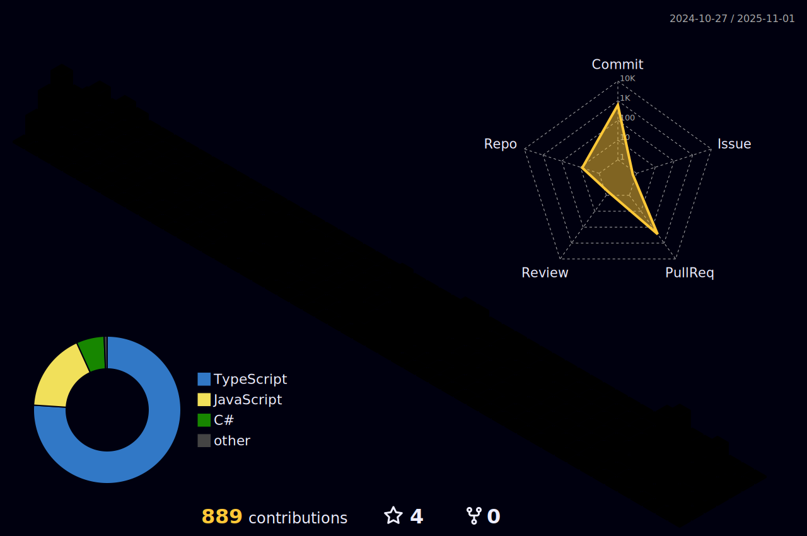

<!--horizontal divider(gradiant)-->

<!--h1 without bottom border-->

  <ul align="center">
    
<h1 style="display: inline-block">Hi 👋, I'm PHAN VAN HUNG</h1>

  </ul>

<!--- snake -->

  

  

<!--h2 without bottom border-->

  <ul align="center">
    
<h2 style="display: inline-block">Confusion is part of Programming</h2>

  </ul>

<!--Intro start-->
- 🔭 I’m currently working on **AWS, React, React Native, Nodejs, MongoDB**

- 🎓 &nbsp;I'm currently studying Information of Technology (IT) at FPT University HCM.
  
- 💬 Ask me about **AWS, react, react-native, nodejs, mongoDB**

- 📫 Feel free to reach me out **hunglorfptu@gmail.com**

- 🏠 Don't hesitate to drop me a **👋** on Discord –  [HungIT](https://discordapp.com/users/phanvanhung) my username!
<!--Intro end-->

<!--- stats & Trophy (start) -->

  <!--- stats (start) -->
<table align="center">
<tr border="none">
<td width="50%" align="center">
  
  
    
   
</td>

<td width="50%" align="center">

  
  
  </td>
</tr>
</table>
<!--- stats (end) -->

<!--- trophy (start) -->

  

<!--- trophy (start) -->

        
<!--- stats (end) -->

<!--h1 without bottom border-->

  <ul align="center">
    
<h2 style="display: inline-block">Technologies That I Know👨🏻‍💻</h2>

  </ul>

<!--tech stack icons-->

  

### ✍️ Random Dev Quote

<!-- Connect with me -->
<!--h2 without bottom border-->

  <ul align="center">
    
<h2 style="display: inline-block">Connect With Me🤝</h2>

  </ul>

<!--icons and links-->

<!--  -->
<!--  -->
<!--  -->

<!--profile visit count-->

  

  

<!--horizontal divider(gradiant)-->

----------------------------------------------------------------------
